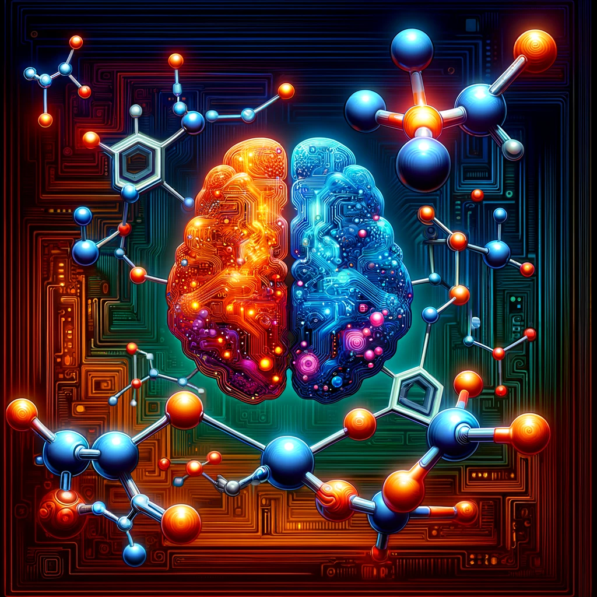

# SynMapper
SynMapper repository, a specialized resource dedicated to advancing the application of reinforcement learning (RL) in the domain of atom-atom mapping for chemical syntheses. This project employs state-of-the-art RL algorithms to predict atom mappings in chemical reactions,

