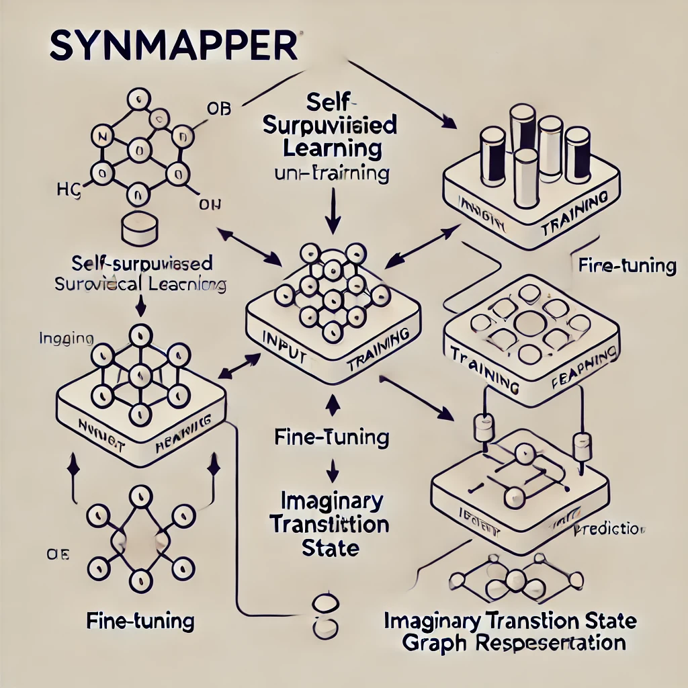

# SynMapper
`SynMapper` is a specialized repository designed to leverage **self-supervised learning** techniques applied to a large-scale dataset of unmapped chemical reactions. Its primary objective is to learn meaningful molecular transformations without explicit atom-mapping annotations. Following the initial **self-supervised learning**, `SynMapper` fine-tunes its models on downstream tasks involving the *Imaginary Transition State* (ITS) graph representation, enabling accurate prediction of atom-atom mappings.

## Contributing
- [Tieu-Long Phan](https://tieulongphan.github.io/)
- [Thanh-An Pham](https://thanh-an-pham.github.io/)

## License

This project is licensed under MIT License - see the [License](LICENSE) file for details.

## Acknowledgments

This project has received funding from the European Unions Horizon Europe Doctoral Network programme under the Marie-Skłodowska-Curie grant agreement No 101072930 ([TACsy](https://tacsy.eu/) -- Training Alliance for Computational)